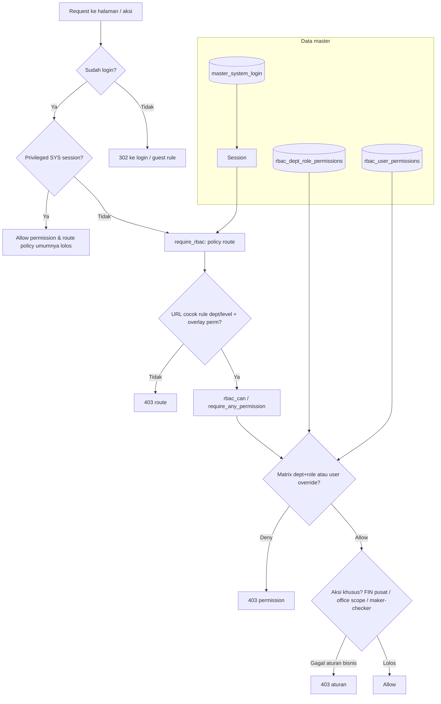

# Alur keputusan akses — User (`master_system_login`) × RBAC

**Tujuan:** satu diagram + urutan logis untuk menjawab *“kenapa user ini bisa / tidak akses halaman atau aksi?”*  
**Bukan:** menggantikan daftar permission (`RBAC_ALL_MODULES_V1.md`) atau policy route lengkap (`RBAC_POLICY.md`).

### Lihat diagram sebagai SVG / HTML

| Cara | Lokasi |
|------|--------|
| **HTML statis** (buka file di browser) | `docs/internal/access_decision_flow.html` — men-embed SVG relatif |
| **Officepack viewer** (di dalam ERP, setelah login) | `/docs/officepack_view.php?f=diagrams/DGM_Access_Decision_RBAC.svg` |
| **Portal dokumen** | `docs/link/officepack_portal.php` → kategori **Diagram** → *Diagram Access Decision — Login × RBAC* |
| **Sumber Graphviz** | `docs/officepack/diagrams/DGM_Access_Decision_RBAC.dot` |

**Regenerasi SVG** (wajib punya Graphviz `dot` di PATH):

```bash
dot -Tsvg -o docs/officepack/diagrams/DGM_Access_Decision_RBAC.svg docs/officepack/diagrams/DGM_Access_Decision_RBAC.dot
```

> Generator `tools/diagrams/generate_diagrams.php` membangun diagram lain dari kode PHP; diagram **ini** sumbernya manual `.dot` (selaras DGM_Absensi, DGM_P2P, …).

### “Kok belum satu layar untuk user + RBAC?”

Pengaturan tetap **dua langkah operasional**: **Master System Login** (identitas, dept, role, office) lalu **RBAC Center** (matrix / override). Menggabungkan keduanya dalam **satu wizard** = fitur produk baru (UX + permission), di luar cakupan dokumen ini — kalau mau ke depan, pola yang masuk akal: dari baris user di Master Login, tombol **“Buka matrix Dept/Role user ini”** yang mengisi query `dept_code` + `role_code` di `/rbac/index.php`.

---

## Sumber data user (login)

| Sumber | Tabel / lokasi | Dipakai untuk |
|--------|----------------|---------------|
| Identitas & profil | `master_system_login` | `username`, `password_hash`, `status`, `department`, `role`, `level`, `office_code`, … |
| Setelah login OK | `$_SESSION` (isi dari baris di atas) | Semua gate berikutnya membaca session, **bukan** mem-parse ulang username |

**Konvensi username** (`StaffCRM_BGR`) hanya label + mudah dibaca; **matrix RBAC memakai kolom `department` + `role`**, bukan string username.

---

## Diagram alur (ringkas)



---

## Urutan cek mental (checklist)

1. **Akun aktif?** `master_system_login.status` (+ tidak deleted) — gagal sebelum session penuh.
2. **Session** — `department`, `role` / `level`, `office_code`, `user_id` konsisten dengan DB setelah login terakhir (ubah DB → user harus login ulang).
3. **Route / URL** — `require_rbac()` + `_shared/rbac_policy.php` (dept/level/method); tanpa overlay wildcard per folder.
4. **Registry URL** — `rmi_page_registry_guard_try()` + `config/page_registry.php`: ACCESS / `route_any` selaras kolom matrix per halaman.
5. **Permission kode** — `rbac_can()` = **matrix** `dept_code` + `role_code` ∪ **override** `rbac_user_permissions` untuk `user_id`.
6. **Scope data** — `office_code` / helper scope dokumen (bukan dimensi matrix 2-kolom).
7. **Aturan bisnis tambahan** — contoh: approve pembayaran pusat → `MgrFIN_BGR` atau SYS; maker-checker; dll.

---

## File terkait (kode)

| Topik | File |
|-------|------|
| Login → session | `master/login.php`, `master/auth.php` (`auth_user()`, `auth_username()`) |
| Route policy | `master/auth.php` (`require_rbac`), `_shared/rbac_policy.php` |
| Page registry guard | `_shared/rmi_page_registry_guard.php`, `config/page_registry.php` |
| Permission matrix | `_shared/rbac.php` (`rbac_can`), tabel `rbac_dept_role_permissions` |
| UI pengaturan | `rbac/index.php` (RBAC Center) |
| Ringkasan kebijakan | `docs/internal/RBAC_POLICY.md` |
| Spesifikasi governance | `docs/governance/RBAC_FINAL_SPEC.md` |

---

## Kapan buat dokumen lain?

- **Tetap satu file ini** untuk *alur keputusan* (gambar + checklist).  
- **Jangan menggabung** seluruh isi `RBAC_POLICY` ke sini — supaya file ini tetap pendek dan dipakai sebagai “peta jalan”.  
- Detail modul / daftar kode permission tetap di `docs/governance/` dan RBAC Center.
